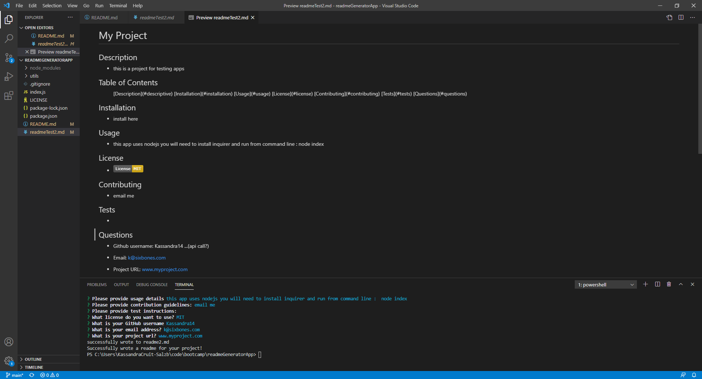

# 09 Node.js Homework: Professional README Generator

## Description

This app is designed to be a simple readme generator.  It is a command-line application that will create a preofessional looking readme which includes:

* Title
* Description
* Installation 
* Usage guidelines
* License
* Contribution information
* Test
* Questions

## This application uses:

Node
Inquirer

## Getting Started

* To use this app - you need to install node and inquirer package then enter in command line:  node index.js

## Walkthrough Video: 

* A walkthrough video demonstrating this app in use can be viewed here:
https://drive.google.com/file/d/1ILT_qCZENojGokqpO3t1QfeNOnFmVYBb/view

##  Screenshot of Readme file:

## URL of the Github Project Repo:

https://github.com/Kassandra14/readmeGeneratorApp
